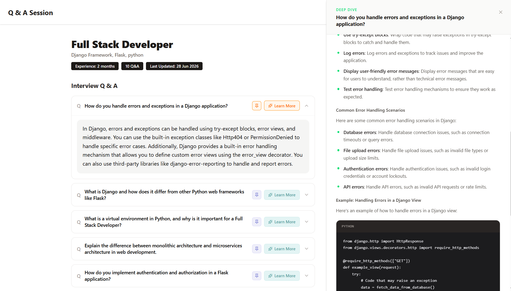
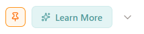
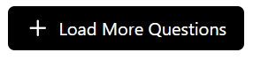
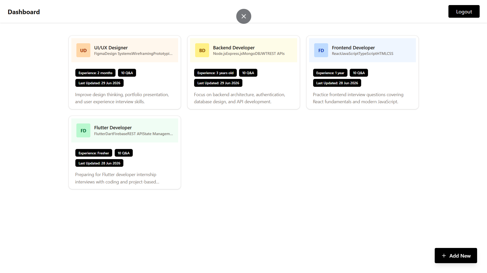
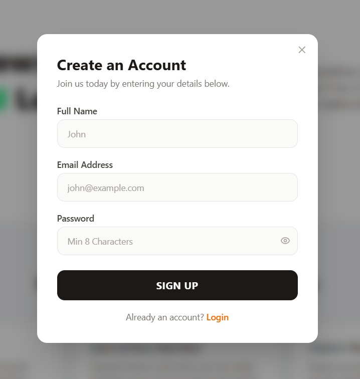

# Interview Prep AI

An AI-powered interview preparation app that generates personalized interview questions and answers based on your role, experience, and focus topics.

## Features

### Personalized Q&A Sessions
Generate role-specific interview questions tailored to your experience level and chosen topics.


### Deep Dive Explanations
Click "Learn More" on any question to get an AI-generated concept breakdown in a side panel.



### Pin & Organize
Pin important questions so they stay at the top of your session.



### Load More
Expand any session with additional AI-generated questions on demand.



### Session Management
Save, revisit, and delete your interview prep sessions from the dashboard.



### Auth
JWT-based signup/login with persistent sessions via localStorage.



## Tech Stack

**Frontend**
- React + React Router
- Zustand (global state management)
- Tailwind CSS

**Backend** *(not included in this repo)*
- Node.js / Express REST API
- JWT authentication
- AI-powered question generation

## Project Structure

```
src/
├── components/
│   ├── AuthModal.jsx          # Login / Signup modal
│   ├── AddSessionModal.jsx    # Create new session form
│   ├── QuestionAccordion.jsx  # Expandable Q&A card
│   ├── LearnMorePanel.jsx     # Sliding side panel with AI explanations
│   ├── SessionCard.jsx        # Dashboard session card
│   └── CustomNavbar.jsx       # Shared navigation bar
├── pages/
│   ├── Landing.jsx            # Marketing / hero page
│   ├── Dashboard.jsx          # Session list page
│   └── Session.jsx            # Individual session view
├── store/
│   ├── authStore.js           # Auth state (Zustand)
│   └── sessionStore.js        # Session state (Zustand)
└── utils/
    └── api.js                 # API helper functions
```

## Getting Started

### Prerequisites

- Node.js 18+
- A running instance of the backend API

### Installation

```bash
# Clone the repository
git clone https://github.com/your-username/interview-prep-ai.git
cd interview-prep-ai

# Install dependencies
npm install

# Create your environment file
cp .env.example .env
```

### Environment Variables

```env
VITE_API_URL=http://localhost:5000/api
```

### Run the App

```bash
npm run dev
```

The app will be available at `http://localhost:5173`.

## Usage

1. **Sign up** or log in from the landing page
2. On the **Dashboard**, click **+ Add New** to create a session — enter your target role, years of experience, and topics to focus on
3. The AI generates a set of interview Q&As tailored to your input
4. Expand any question to reveal the answer
5. Click **Learn More** to open a deep-dive explanation in the side panel
6. **Pin** questions you want to revisit — pinned questions float to the top
7. Click **Load More** to generate additional questions for the same session

## License

MIT
